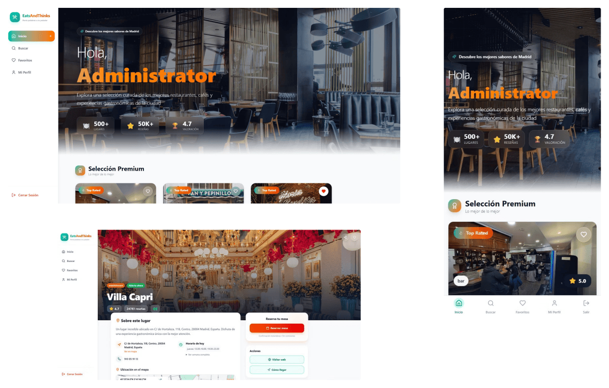
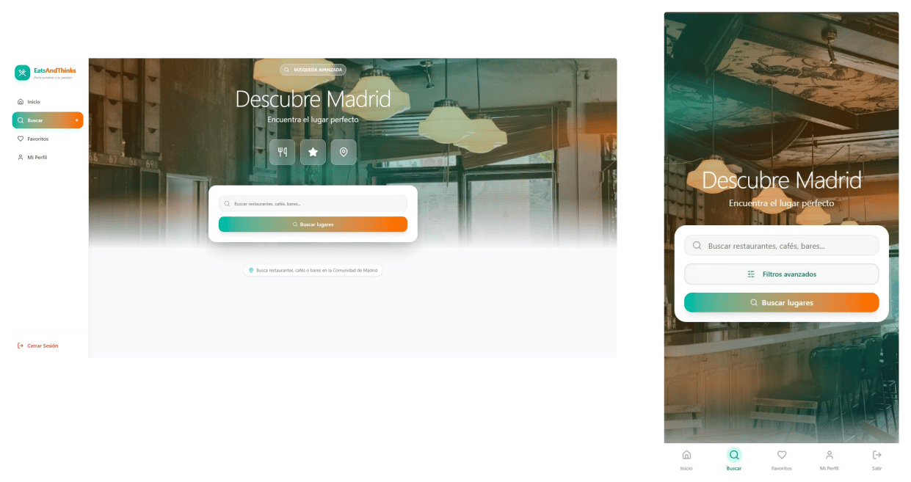
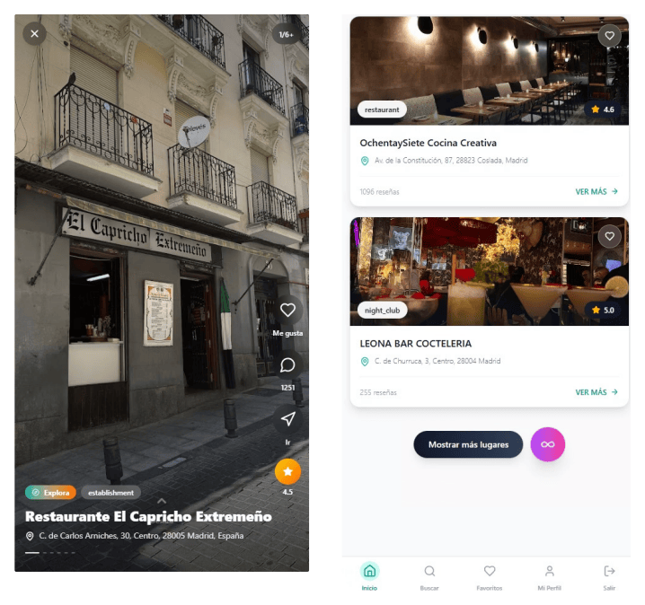
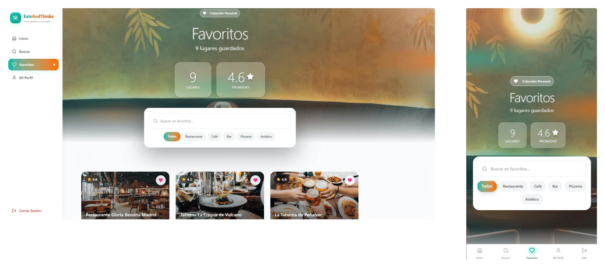
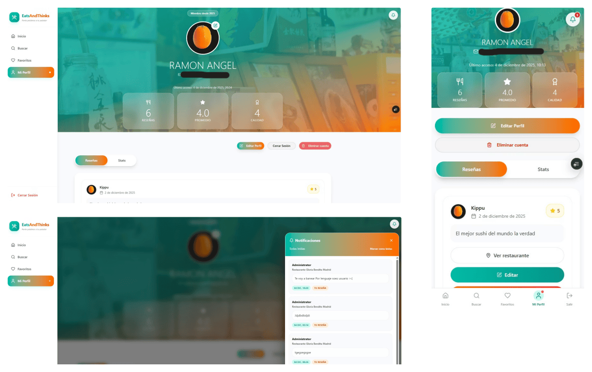

<div align="center">

# EatsAndThinks

**Descubre dónde comer en Madrid, guarda tus sitios favoritos y comparte reseñas.**

Aplicación web y PWA hecha como proyecto de fin de ciclo del grado superior de Desarrollo de Aplicaciones Multiplataforma (DAM).


<br>


[Demo en Vercel](https://eats-and-thinks-web-prototype.vercel.app/) (servidor ahora en mantenimiento) · [Capturas](#capturas) · [Stack](#stack) · [Arranque rápido](#arranque-rápido)

<br>



</div>

## Qué hace

Buscas restaurantes por zona y te salen los que hay cerca, con su ficha: fotos, tipo de cocina, valoración, horario y accesos directos a la web del local y a la ruta en Google Maps. Los datos de los establecimientos vienen de Google Places; las reseñas, los favoritos y los usuarios son propios y se guardan en mi base de datos.

- **Búsqueda con filtros:** tipo de cocina, rango de precio, valoración mínima y si están abiertos en ese momento.
- **Vista infinita estilo TikTok:** los locales a pantalla completa, uno detrás de otro, con me gusta, reseñas y ruta a mano. El listado normal tiene infinite scroll y conserva la posición cuando vuelves de la ficha de un restaurante.
- **Favoritos:** colección personal con buscador y filtros por categoría (restaurante, café, bar, pizzería, asiático…).
- **Reseñas con respuestas:** puedes escribir reseñas, responder a las de otros y te llega una notificación cuando alguien te responde.
- **Perfil:** foto de perfil, estadísticas de tus reseñas con gráficas, edición de datos y borrado de cuenta.
- **Cuentas:** registro con PIN de recuperación, bloqueo temporal tras varios intentos fallidos de login, desbloqueo con el PIN y modo invitado para probarla sin registrarte. También guarda tu historial de búsquedas.
- **Panel de administración:** gestión de usuarios (roles, baneos y permiso para escribir reseñas), de los locales añadidos por la comunidad y de las reseñas, con estadísticas.
- **Mobile first e instalable:** en móvil la navegación va en una barra inferior y el botón atrás sigue el flujo que espera el usuario; en escritorio hay una barra lateral. Se puede instalar como PWA.

## Capturas

Escritorio a la izquierda y móvil a la derecha.

### Buscar



### Vista infinita

En móvil: a la izquierda, los locales a pantalla completa; a la derecha, el listado con «Mostrar más lugares».

<p align="center">
  
</p>

### Favoritos



### Perfil y notificaciones



## Stack

| Capa | Tecnologías |
| --- | --- |
| Frontend | React 18 + TypeScript sobre Vite, `vite-plugin-pwa`, Tailwind CSS, shadcn/ui (Radix UI), Recharts, Axios, react-toastify |
| Backend | Java 17, Spring Boot 4 (Web, Data JPA, Security), JWT con `jjwt`, `WebClient` para Google Places, Lombok |
| Datos | MySQL 8 |
| Infraestructura | Docker Compose con builds multi-etapa, Nginx, Vercel (frontend) y Railway (backend + MySQL) |

**Frontend.** Las llamadas al backend van con Axios y un interceptor que engancha el JWT en las peticiones autenticadas. El estado global lo llevo con contextos de React, sin librería externa: para una app de este tamaño Redux era pasarse.

**Backend.** API REST con Spring Security y autenticación por JWT. Controladores y servicios separados por dominio: autenticación, usuarios, locales, reseñas y respuestas, favoritos, notificaciones, historial de búsqueda y administración. Las búsquedas y las fichas de Google Places pasan por el backend, que es el que llama a la API.

**Infraestructura.** Docker Compose levanta frontend, backend y MySQL de una vez. En producción el front se sirve con Nginx.

## Arranque rápido

Lo más cómodo es Docker, que te levanta las tres piezas de una vez. Antes copia `.env.example` como `.env` y rellena la API key de Google y el secreto de JWT:

```bash
# Windows
start-docker.bat

# Mac / Linux
docker-compose up --build
```

Si prefieres levantarlo a mano necesitas JDK 17, Maven, Node 18 o superior y un MySQL:

```bash
cd eatsandthinks-backend
mvn spring-boot:run

cd "../EatsAndThinks Web Prototype"
npm install
npm run dev
```

## Variables de entorno

| Variable | Pieza | Para qué |
| --- | --- | --- |
| `GOOGLE_PLACES_API_KEY` | Backend | Google Places y mapas |
| `JWT_SECRET` | Backend | Secreto para firmar los tokens (mínimo 32 caracteres aleatorios) |
| `DATABASE_HOST`, `DATABASE_PORT`, `DATABASE_NAME`, `DATABASE_USERNAME`, `DATABASE_PASSWORD` | Backend | Conexión a MySQL (con Docker Compose ya van configuradas) |
| `CORS_ALLOWED_ORIGINS` | Backend | Orígenes desde los que se puede llamar a la API |
| `VITE_API_BASE` | Frontend | URL de la API (por defecto `http://localhost:8080/api`) |

La API key la sacas de Google Cloud con Places API y Maps JavaScript API activadas. Ningún secreto va en el repo: `application.properties` solo lee estas variables y, si falta alguna, el backend no arranca. En `.env.example` tienes la plantilla y cómo generar el secreto de JWT.

## Estructura

```
eatsandthinks-backend/          API REST, seguridad y servicios
EatsAndThinks Web Prototype/    UI, componentes, contextos, servicios y estilos
docs/capturas/                  Capturas de este README
docker-compose.yml              Orquestación de frontend, backend y MySQL
.env.example                    Plantilla de las variables con secretos
init-db.sql                     Datos iniciales
start-docker.bat / stop-docker.bat
```

En `DEPLOYMENT.md` está explicado el despliegue de la PWA y de Docker, y `EatsAndThinks Web Prototype/generate-icons.html` genera los iconos de la PWA.

## Comandos frecuentes

```bash
# Levantar el stack completo
docker-compose up --build

# Parar
docker-compose down

# Ver logs
docker-compose logs -f

# Rebuild desde cero, borrando volúmenes
docker-compose down -v && docker-compose up --build

# Frontend
npm run dev
npm run build
npm run preview

# Backend
cd eatsandthinks-backend
mvn spring-boot:run
```

## Despliegue

Frontend en Vercel:

```bash
npm install -g vercel
cd "EatsAndThinks Web Prototype"
vercel --prod
```

Backend y base de datos en Railway: creas el proyecto, lo conectas al repo de GitHub, añades una base de datos MySQL y configuras las variables de entorno de arriba.

## Cosas que me costaron

**CORS con las peticiones preflight.** Tenía CORS configurado en el backend y aun así el navegador bloqueaba todo con "Access-Control-Allow-Origin missing". El problema era que no estaba permitiendo el método OPTIONS, que es el que manda el navegador antes de la petición real. Se arreglaba con una línea en `SecurityConfig.java`, pero tardé un buen rato en dar con ello.

**Los filtros no llegaban al backend.** Los mandaba como objeto y se perdían por el camino. Acabé construyendo el query string a mano con `URLSearchParams`.

**401 en todas las peticiones autenticadas.** El interceptor de Axios petaba cuando el token era `null` (usuario sin loguear) y dejaba de adjuntar la cabecera en las llamadas siguientes. Se resolvió comprobando que el token existe antes de añadirlo.

**Locales sin fotos.** Google Places no siempre devuelve imágenes y la pantalla quedaba con huecos. Monté un pool de imágenes de respaldo categorizadas por tipo de cocina: si no hay foto, se usa una del pool que corresponda.

## Problemas comunes al levantarlo

- Si los puertos están ocupados, cámbialos en `docker-compose.yml` (por ejemplo `ports: - "8081:80"`).
- Para ver qué le pasa a MySQL: `docker-compose logs mysql` y `docker inspect eatsandthinks-mysql`.
- Si el front se queda raro tras cambiar dependencias, borra `node_modules` y `package-lock.json` y reinstala.

## Limitaciones

- No hay tests automatizados. Las pruebas fueron manuales, que es lo que pedía el proyecto, pero es lo primero que le añadiría.
- Las fotos de Google Places se piden directamente desde el navegador con la API key que entrega el backend, así que la key acaba en el cliente. Lo siguiente sería servir las fotos a través del backend.
- Las reseñas no tienen moderación ni sistema de reportes más allá del panel de administración.
- Cada búsqueda pega a la API de Google Places. Con tráfico real habría que cachear las respuestas en base de datos con un tiempo de expiración, porque la cuota gratuita mensual se agota rápido.
